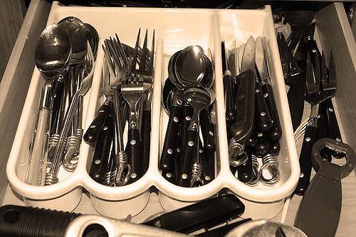
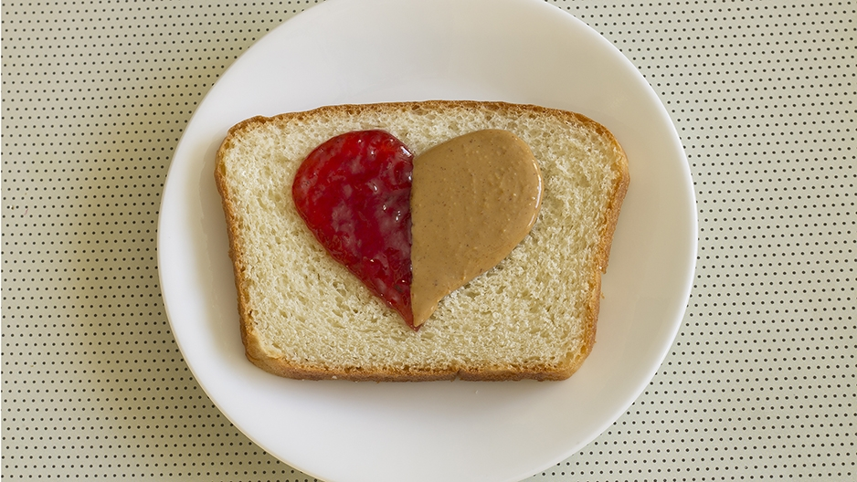

It's easy to feel intimidated by the idea of writing a tutorial -- especially if it's for a project you love and care about. Tutorials need to be friendly and inviting, provide information clearly and concisely, and leave out any assumptions about the reader. This is a hard thing.

In order to get myself un-stuck when I'm feeling this way, I put together a little guide to get myself going. The following steps may not work for everyone, but maybe they'll give you the kick start you need, too.

_Note: As an example throughout this post, I'm going to use the perennial "making a PB&J" exercise. This exercise is often used in computer science classrooms to illustrate how you need to be overly direct, explicit, and detailed when telling a computer to do anything. The same principles apply to technical writing, although not quite as literally as they do in the original exercise. You can see an overview of the exercise from an MIT course [here](https://static.zerorobotics.mit.edu/docs/team-activities/ProgrammingPeanutButterAndJelly.pdf) [PDF]._

### Step one: Ask yourself why

Before you write your tutorial, explicitly define what you want the reader to learn by the end. This will help you emphasize the things that are relevant to these **learning outcomes** and minimize the peripheral details.

> After reading this tutorial, users should know what tools they need to make a PB&J and the basic steps to take when constructing the sandwich.

### Step two: Do it yourself

Walk through the process you're going to ask the reader to do and take notes. Ultimately this should be a **list with brief, short statements** explaining the _exact_ actions you took.

> 1. Take the bread out of the cupboard
> 2. Take a knife and a spoon out of the drawer
> 3. Open the bag of bread and take out two pieces
> 4. Open the jar of peanut butter
> 5. Stick your knife in the peanut butter to scoop some out
> 6. Spread the peanut butter on one side of one piece of bread
> 7. ...

... and so on.

### Step three: Flesh it out

The list you created in step two is the basic outline of your tutorial. You want your user to go through the same steps you did to achieve the same goal. But in order to make sure you aren't glossing over anything, you can add a little more context to each step by adding a **concrete example** and **an explanation of _why_** the step is inherent to the process.

Remember: it's likely that the person following the tutorial has never done this before. Be very conscious of the steps you put together implicitly as one step that, for someone else, may require two or three steps.

> 2&#46; Take a knife and a spoon out of the drawer
>
> It's important to have both a knife and a spoon in order to avoid getting jelly in your peanut butter (or vice versa). If you only have one utensil, however, it's acceptable to use what you have and wash or wipe off the utensil in between spreading the peanut butter and spreading the jelly.
> 
> 

### Step four: End with encouragement

Trying something new is _hard_. It's hard to get started and it's hard to keep going when you get stuck -- which is maybe why you found yourself reading this blog post. If someone chooses to do the hard work of trying something new, they should be rewarded for that work!

> Congratulations! You made a delicious peanut butter and jelly sandwich. Great job!
> 
> 

## And there you have it

This is a super quick guide to writing an effective tutorial. If you used this to help you get unstuck, I'd love to see what you made! If you want even more words from me about writing tutorials, see my [tutorial on developing tutorials](https://lyzidiamond.com/tutorial-dev) (in tutorial/slide form).
