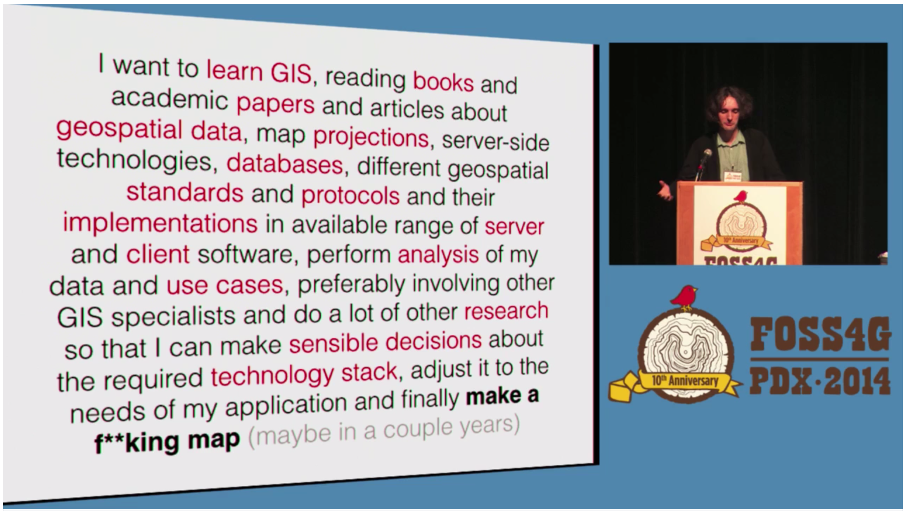

<em>Today, I [posted an email](http://lyzidiamond.com/posts/what-to-learn-first) I sent to someone who is new to mapping and unsure where to start. My response touched on some of my thoughts on geographic education, and I remembered that I had sent another email I wanted to share.

A couple few weeks ago, my friend [Katie Kowalsky](https://twitter.com/katiekowalsky) from the University of Wisconsin and [MaptimeMadison](http://twitter.com/maptimemadison) emailed me to ask about which [Mapbox](https://mapbox.com) tools she and her colleagues should be using to teach [CartoCSS](https://www.mapbox.com/mapbox-studio/style-manual/#cartocss). This got me considering all kinds of questions about tools and teaching, so I replied to Katie with a mini-rant. Some of my comments are the same as those I made in my post earlier today, but the mini-rant is below regardless. Enjoy.</em>

-------------------------

It is not a stretch to say that the majority of academic courses in our field focus on learning how to use particular tools to achieve a goal or create a product. In traditional GIS settings, that tool is ArcGIS. In graphic design settings, it's Adobe Creative Suite. It's not a coincidence that these degree programs attract a lot of people who want to learn a tool to get a specific job. For a long time, if you learned ArcGIS, you could get a job working in GIS after you graduated, so it makes sense that courses have been taught this way.

_A slide from [Vlad](https://twitter.com/mourner)'s [presentation](https://vimeo.com/106112939) at [FOSS4G 2014 in Portland](https://2014.foss4g.org)._

As I'm sure you know, the times, they are a-changin'. Nowadays, you don't succeed simply by learning one tool. To be a professional in the modern geospatial environment, you need to know a lot of different tools. So what is on that list? What should we be teaching the students of geographic information studies to prepare them for the workforce?

It's a hard question to answer simply because the field is changing so much all the time. [Mapbox](https://mapbox.com) doesn't have official guidance on which tools to use for what because things move too fast to do that. Someone could have an idea tomorrow, crank on it for a week, and it could be the next [Turf.js](http://turfjs.org) or [Mapbox Studio](https://mapbox.com/mapbox-studio). **The field simply moves too fast to teach a tool now and have it be relevant and useful in a year.**

If we take a step back for a second, it becomes clear: we have to stop teaching tools and start teaching problem-solving. We need to get the educational train on the same tracks as the field has been on for a little while now. We should be challenging students to figure out how to solve the problems instead of showing them how to use one tool to solve a given set of problems.

See, this is field is _hard._ And that's why a lot of us have been attracted to it, because we like to solve hard problems. We can do our best to make it easy to get to a place where we feel comfortable tackling these problems, but I feel like we're doing a disservice to students if we're teaching a tool instead of teaching the art of blazing a trail to a new solution.

So how do we do this? I have no idea. I really don't. I just know that the field is changing all the time, and we should be learning how to be adaptable. Otherwise we end up left in the dust, pushing buttons instead of solving problems.
